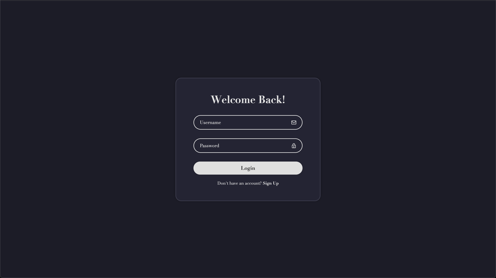
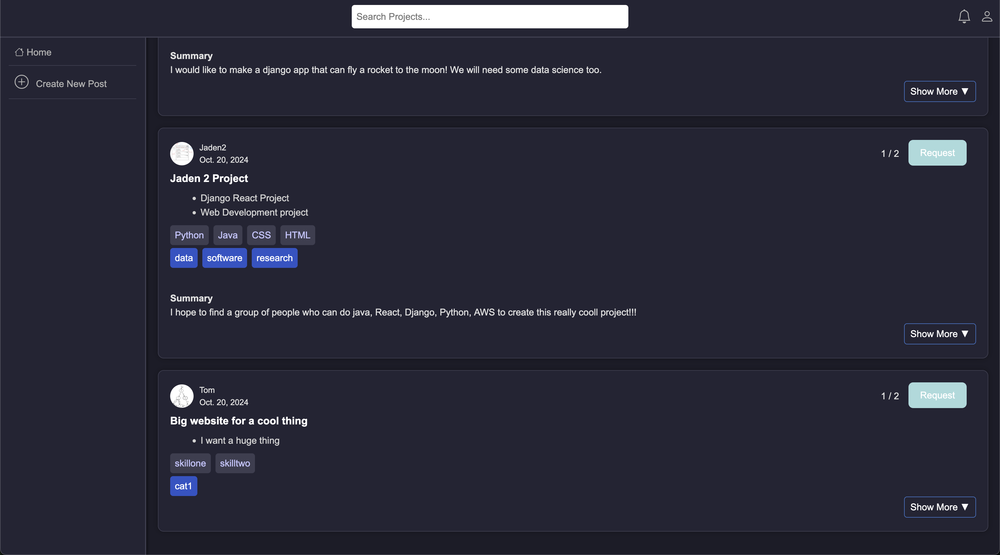
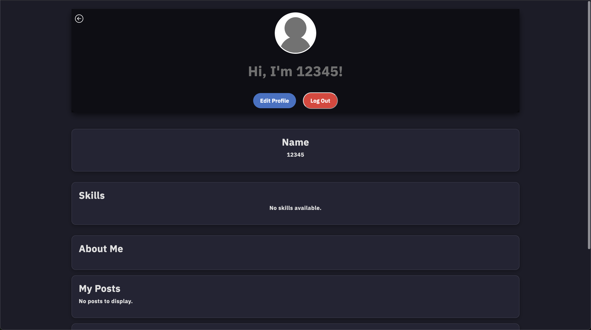

# SkillSync 
*Team formation through skills.*

SkillSync is a web application built during a 48 hour hackathon for the prompt of **"Communication Beyond Worlds"** Our app helps users form collaborative project groups by matching skills to needs.

Users can create profiles listing their skills, browse open project ideas, and request to join teams where their abilities are needed. Creators can specify the skills they’re looking for in team members, making the process of team formation quick and easy.

---

## Tech Stack

- **Backend**: Django  
- **Frontend**: HTML, CSS  
- **Database**: PostgreSQL (via Django ORM)  
- **Deployment**: Docker  
- **Team Size**: 4  

---

## Features

- **Account Creation and Login** – Each user can create and manage their profile  
- **Skill-Based Profiles** – Users list relevant technical and creative skills  
- **Post Project Ideas** – Users can create posts to describe ideas they want to work on  
- **Skill Requirements Per Post** – Posts can specify required skills for applicants  
- **Request to Join Projects** – Users can browse and request to join open project teams  
- **Full CRUD Functionality** – Profiles, posts, and requests can be created, updated, and deleted  

---

## Screenshots

  
 
  

---

## How to Run (Locally with Docker)

Step 1: cd Hackathon2024/
Step 2: cd hackathon2024/
Step 3: docker-compose build
Step 4: docker-compose up
Step 5: http://localhost:8000/home